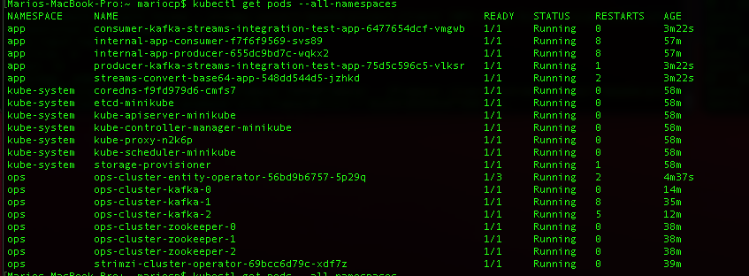
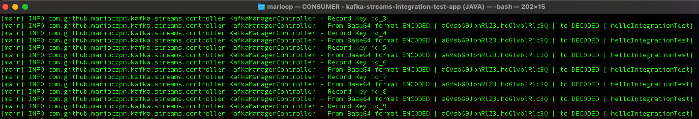
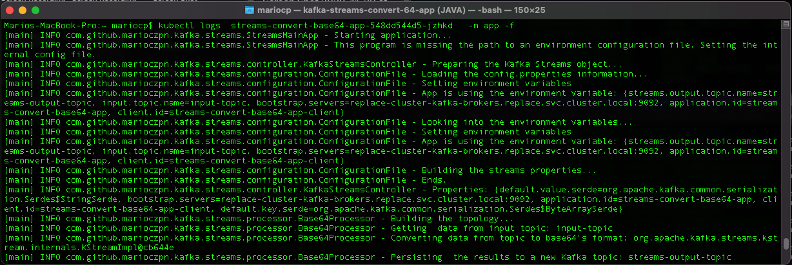
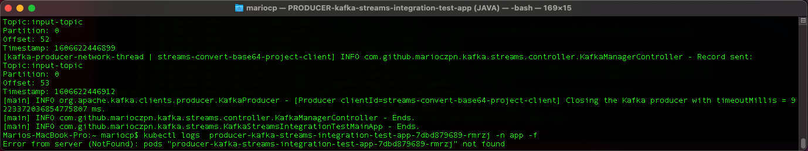

# Deployment of Strimzi/Kafka cluster and example application using Kafka Streams API

This whole project was developed in one week, during free time. A week of learning and discoveries.

This solution are divided in the three main phases.

 - **Deployment Automation for Strimzi, Kafka cluster and APPs:**
	 - For this phase was developed an automation using [Ansible](https://docs.ansible.com/ansible/latest/index.html) to set up a
   kubernetes cluster in my local.
   
	 - Download/Build and push Strimzi project into Container Registry. 		
		 - Image was pushed   to docker hub  and [quay.io](https://quay.io/) .
	- Deploy Strimzi Operator and Kafka cluster to a namespace.
	
 - **Results:**

Running Automation Scripts to build and deployment into kubernetes

 - Pods running

- Cxample client application, which communicates with Kafka

 - **Kafka Streams Application**
	  - Developed deploy **script** for this application
	  - Developed a **Java application**  to consume all messages from topic X, convert them to base64 format and produce them to topic Y. 
	 - The [kafka-streams-convert-base64-app](https://github.com/marioczpn/kafka-streams-convert-base64-app) code is available
	 - **CI system** is **setup** and it is using [github actions](https://docs.github.com/pt/free-pro-team@latest/actions) and pushing the image to [quay.io/marioczpn/kafka-streams-convert-base64-app](https://quay.io/repository/marioczpn/kafka-streams-convert-base64-app)
	  
 
 - **Results:**
 
 The kafka-streams-convert-base64-app consuming the message from input-topic and persisting to streams-output-topic.
 

 - **Integration Test**
	  - Developed deploy **script** for this application
	 - Developed a Java  **application** to verify the *Kafka Streams Application* is consuming all messages from topic X and converting  them to base64 format and produce them to topic Y. 
	 - The [kafka-streams-convert-base64-app](https://github.com/marioczpn/kafka-streams-convert-base64-app) code is available
	 - **CI system** is **setup** and it is using [github actions](https://docs.github.com/pt/free-pro-team@latest/actions).  and pushing the image to [quay.io/marioczpn/kafka-streams-integration-test-app](https://quay.io/repository/marioczpn/kafka-streams-integration-test-app)

 - **Results:**
 
 The kafka-integration-test verifying the messages from streams-output-topic and producing to  input-topic.
 
 - Producer to  input-topic.

- Consumer from streams-output-topic

## **Modules**:

All **requirements** *have been * **implemented** and for more informations,  how to run and implementation details are available in the modules bellow:

 1. [Setup kubernetes cluster using minikube](https://github.com/marioczpn/strimzi-kafka-cluster-deployment-automation/blob/master/01-setup_kubernetes_cluster_minikube.md)
 2. [Download/Build the STRIMZI project and push them into container registry](https://github.com/marioczpn/strimzi-kafka-cluster-deployment-automation/blob/master/02-download-build-strimzi-source.md)
 3. [Deploying STRIMZI cluster operator and Kafka cluster into local kubernetes](https://github.com/marioczpn/strimzi-kafka-cluster-deployment-automation/blob/master/03-deploy-strimzi-kafka-cluster.md)
 4. [Deploy an example client application, which communicates with kafka](https://github.com/marioczpn/strimzi-kafka-cluster-deployment-automation/blob/master/04-deploy-example_client-app.md)
 5. [Deploy Java Application which will use Kafka Streams API to consume all messages from topic X, convert to base64 format and produces to Y](https://github.com/marioczpn/strimzi-kafka-cluster-deployment-automation/blob/master/05-deploy-streams-convert-base64-app.md)
 6. [Deploy Application to verify the kafka-streams-convert-base64 app is converting the messages from topic X to Y](https://github.com/marioczpn/strimzi-kafka-cluster-deployment-automation/blob/master/06-deploy-integration-test.md)
 
 
